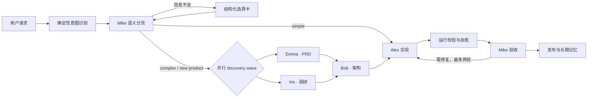

# Atoms Demo · Agent Architecture v2

## 目标

这版重构把系统从“多个 Prompt 串行拼接”升级为一个可观察、可恢复、可并发的 Agent Runtime。UI、SSE、持久化与 LangSmith 使用同一套语义：一次运行由若干阶段、Agent 节点、工具调用、结构化产物和用户决策组成。

## 运行链路



## 关键设计

### 1. 双层意图识别

`backend/core/intent.py` 先用确定性规则识别任务类型、产物类型、复杂度提示和必要角色。Mike 再处理语义与业务模糊性。这样可避免模型偶发地把 React 项目路由成单 HTML，也避免用户已经说清楚后仍被重复提问。

### 2. 结构化交互协议

所有事件使用 v2 envelope：

```json
{
  "schema_version": "2.0",
  "event_id": "...",
  "sequence": 7,
  "session_id": "...",
  "run_id": "...",
  "timestamp": "...",
  "type": "tool_result"
}
```

澄清问题保持 `{id, question, type, required, options, allow_custom}`，选项保持 `{id, label, description, recommended}`。前端直接渲染单选、多选和自定义答案，不再要求用户手写格式化答案。

团队模式包含强制需求确认门：模型认为信息不足时展示针对性澄清题；信息已充分时仍展示一次“需求理解、执行计划、交付形态、确认或调整”卡片。用户确认后才启动执行 DAG。

### 2.1 安全实时预览

模型 token 不直接进入 iframe。前端先缓冲代码，提取 `<!doctype>/<html>` 到 `</html>` 的完整片段，再检查 `body`、`script`、`style` 是否闭合；只有校验通过的快照才更新 `srcDoc`。流式半成品、Markdown 围栏和 HTML 前后的解释文字只保留在代码工件中，不会被当作页面正文渲染。

### 3. DAG 并发与失败策略

`Step.parallel_group` 表示同一个执行 wave。复杂任务的 Emma 与 Iris 会并发执行；协调器在 wave 全部结束后一次性提交 artifacts，避免下游看到半成品。

- `required=true`：失败会停止 wave，但保留最新 checkpoint，可重试。
- `required=false`：产生 `agent_error(recoverable=true)`，记录降级并继续。
- 每个成功节点立即 `save_session`，进程异常不会让整个 pipeline 从头开始。

### 4. 分层记忆

- Session/Redis：当前 DAG 位置、事件序号、临时 artifacts。
- `projects.json`：作品、完整结构化 conversation。
- `memory.json`：最近 16 条对话、已确认事实和决策，作为有界 Prompt 上下文。
- `progress.md / decisions.md / architecture.md`：人可读的项目记忆与审计日志。

历史对话不会再仅依赖进程内列表；从作品页继续对话时，会重建 Session 并加载项目长期记忆。

### 5. Agent loop 容错

- LLM：429、5xx、网络错误指数退避；Key、余额等永久错误快速失败。
- Tool：默认 30 秒超时、未知工具状态、异常转结果、相同调用超过两次熔断。
- Loop：默认最多 8 个工具轮次，可通过环境变量调整。
- Output：HTML 运行校验最多两轮自愈；Mike 验收失败最多两轮修复复审。
- State：每个节点与并行 wave 后保存 checkpoint。

环境变量：

```bash
AGENT_MAX_TOOL_ROUNDS=8
AGENT_TOOL_TIMEOUT_SECONDS=30
```

### 6. LangSmith 可观察性

每个 Agent 是一个 chain span，每个工具调用是嵌套 tool span。Agent span inputs 包含完整 system/user Prompt、结构化上下文与可用工具；outputs 包含模型完整输出和工具调用记录。工具 span 记录 call id、参数、完整结果、状态与耗时。统一 metadata 包含 `session_id / agent_id / prompt_key / iteration`，tags 可按 Agent、Prompt 和工具过滤。

启用：

```bash
LANGSMITH_TRACING=true
LANGSMITH_API_KEY=...
LANGSMITH_PROJECT=atoms-demo-v2
```

### 7. 用户可安装 Skill

内置 Skill 仍来自 `backend/strategies/` 且为只读。用户上传的 YAML/JSON Skill 进入独立安装链路：

```text
parse → schema/security validate → canonical persist → activate
```

用户 Skill 只能声明系统中已经注册的工具，不能上传 Python/JavaScript 可执行代码，也不能覆盖内置 Skill。启停状态保存在 `data/user_skills/_registry.json`；`get_skill_manager()` 每次以“内置 prototype + 已启用用户 Skill”生成运行时快照，因此无需重启即可参与关键词路由和 Prompt 注入。

### 8. 知识库、记忆与知识广场

- 上传默认 `remember=true, publish=false`，即进入当前用户的私有长期知识记忆。
- 创建任务时可显式选择知识条目，将完整抽取文本加入本次 Context。
- 未显式选择但已记忆的条目，以有界摘要加入 `memory_snapshot.user_knowledge`。
- 只有用户明确设置 `published=true` 的条目才进入知识广场；其他用户只能引用公开条目，不能读取私有条目。
- 广场只返回摘要，个人接口按 owner 隔离；文件大小、文本长度和标签数量都有上限。

## 验证

```bash
PYTHONPATH=backend python3 -m unittest backend/test_architecture_v2.py
PYTHONPATH=backend python3 -m unittest backend/test_extensibility.py
python3 backend/test_flow.py
cd frontend && npm run build
```

新增回归覆盖：事件协议、结构化选项、意图识别、并行 DAG、关键/可选分支定义、长期记忆边界、Skill 安装/停用、未知工具拒绝、私有知识隔离和显式发布。`work/smoke_v2.py` 可在未配置 LLM 时跑完整模拟链路。
